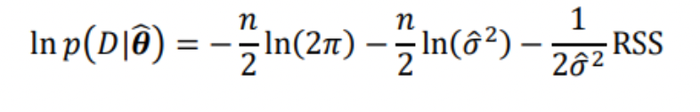
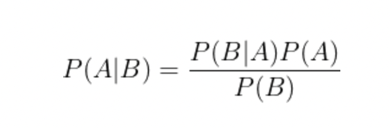

# Introduction to EEG signals?

EEG stands for Electroencephalogram which are electrical signals that measured the electrical activity of the brain (St et al., 2016). To get the EEG result, electrodes consisting of small metal discs with thin wires are pasted onto scalp. The electrodes detect tiny electrical charges that result from the activity of your brain cells and thus obtained charges are amplified and appear as a graph on a computer screen, or as a recording that may be printed out on paper. The main purpose of EEG is to detect potential problems (encephalitis, hemorrhage, epilepsy,Parkinson's disease and other) with brain cell communication by painless method (Healthline, 2012).

Here in the data set, we have four input EEG signals, one output signals and time of each signals.

## Objectives

Our objectives are as follows:

1.  To visualize the trend and patterns in the EEG signals over time.
2.  To assess the fit of the polynomial regression model to the EEG signals and estimate the parameters of the model.
3.  To use a simulation-based approach to estimate the posterior distribution of the model parameters, allowing for uncertainty in the model and data.

### Importing required library

```{r}

library(ggplot2) # implementation of the grammar of graphics - complex visualizations
library(GGally)  # create a matrix of scatter plots, with histograms or density plots
library(tidyverse) # data manipulation, exploration, and visualization
library(tidymodels)  # Split the data into training and testing
library(moments) # calculating and plotting descriptive statistics
library(dplyr) # data manipulation toolkit for working with structured data
library(ggExtra) # additional functionality to ggplot2
library(readr) # fast and friendly file reading
library(ggpubr) # customizing ggplot2 based publication ready plots

#setting the theme to light 
theme_set(theme_light())

```

### Importing data set

```{r}

# Importing time, input signals and output signal data and storing them to variable

time <- read_csv("Time_in_second.csv")

x <- read_csv("X_input_signal.csv")

y <- read_csv("Y_output_signal.csv")


# Add a new row with value 0 to the dataframe time, it can be used for some preprocessing step like adding a baseline value to the dataframe.

time <- rbind(0, time) 


# Viewing data if they are render properly or not 
head(y)
head(x)
head(time)


```

Now, as we have loaded the date set, we are going to renaming the columns of three data frames 'x','y' and 'time.

```{r}
# First time of code is used to rename all the columns of dataframe x, the function rep("x", ncol(x)) will repeat the string "x" ncol(x) times, where ncol(x) is the number of columns in the dataframe x.

# The function paste0(...) is used to concatenate these strings with the sequence of numbers 1:ncol(x) separated by a comma.

# colnames(y) <- "y" This line of code is used to rename the columns of dataframe y to "y"

# colnames(time) <- "time" This line of code is used to rename the columns of dataframe time to "time"

colnames(x) <- paste0(rep("x", ncol(x)), 1:ncol(x)) 
colnames(y) <- "y"
colnames(time) <- "time"
```

One we renamed the data frame, we are going to create new data frame called df by appending the columns of time, x and y together in column-wise order. Here the resulting data frame df will have the same number of rows as the original data frames and the number of columns will be the sum of the number of columns in time, x, and y.

```{r}

# cbind stands for column bind.

df = cbind(time, x, y)

# head df will allow us to see the structure of dataframe.
head(df)
```

# Task 1: Preliminary data analysis

The initial examination of a data set before conducting more advanced and in-depth analysis is called preliminary data analysis. Here we will be looking at the descriptive summary of data set and explore missing values.

### Descriptive summary of the data set

```{r}
# summarizing the data using summary() function
summary(df)

```

Here we can see that the mean of time is 0.2 second and output signal is 0.15235 of amplitude. Interestingly the mean of incput signal is coming in minus.

### Missing values

```{r}
# Using is.na function to see 
missing_values <- is.na(df)
missvalues <- sum(missing_values)

print(sprintf("Number of missing value in the dataset is %d", missvalues))
```

Here we have zero missing data (NA). Which is quite good.

## Task 1.1: Time Series Plots of Input and Output EEG Signals

Here, we are focusing on creating time series plots of input and output EEG signals. Our concern is to plot 4 input signals into a single graph. So, for that we will work with Base R ts() functions. To do so, we need data either in matrix or vector. So here we are going to convert our input data into matrix using as.matrix() function.

```{r}

# Assigning the matrix representation of the variable input signals x into xmat.Then it prints out the matrix representation of the variable "xmat"

# Then the code assigns the column names "X1", "X2", "X3", and "X4" to the columns of the matrix "x" using the "colnames" function.

# It changes the column names of the matrix x to "X1","X2","X3","X4"

xmat <- as.matrix(x)
print(xmat)
colnames(x)<-c("X1","X2","X3","X4")

#Similar process as above for output data Y.

ymat <- as.matrix(y)
print(ymat)
colnames(y)<-c("Y")


# Plotting the time series plot with ts() where it takes input as matrix. We then sets the start and end times of the time series to the minimum and maximum values of the "time" variable. It also sets the frequency of the time series to 1. And then it creates a plot of the time series "xmat.ts" with a main title "Time series plot of Input Signals", x-axis label "Time", and y-axis label "Input signal".

# Here we set frequency = 1 as with this we are indicating that the observations in the time series are at the same level of granularity, that is at the same unit of time (second).  

xmat.ts<-ts(xmat,start = c(min(time),max(time)),frequency =1)
plot(xmat.ts,main = "Time series plot of Input Signals", xlab = "Time", ylab = "Input signal")


# Same as above for output signals Y.

ymat.ts<-ts(ymat,start = c(min(time),max(time)),frequency =1)
plot(ymat.ts,main = "Time series plot of output Signals", xlab = "Time", ylab = "Output signals")


```

Here, we see that in time is plotted in X-axis, input/output signals in Y-axis.

There is no consistent trend (upward or downward) over the entire time span. The series appears to slowly wander up and down have infrequent peaks. We can say the data show random variation.

In input signals time series plot, we do not see any rapid spikes which shows there is neither external causes nor entry errors could have affected the data. There are no obvious outliers. Also, it's difficult to judge whether the variance is constant or not.

Input signals after 150ms seems to have lowest sudden changes to trends and reveals considerably less noise and fewer spikes. Also, X4 appears to be the most stable of the four signals, with fewer spikes and a more recognizable pattern.

For output signals we see a drastic down shift after around 60ms and then drastic upward. This change is most lowest hit.

## Task 1.2: Distribution for each EEG signals

We an use histogram, density plot, box plot or violin plot. Though most popular graph is histogram, however, here we will also be creating density plot along with histogram using ggplot2.

As density plot are better at determining the distribution shape because they're not affected by the number of bins like in histograms. In order word we can say density plot is the continuous and smoothed version of the histogram. In the choice of kernel function in a density plot depends on the characteristics of the data and the goals of the analysis.

For histogram we are using bin width instead of bin as it is more appropriate method. Also, histograms can give us a rough idea of the overall shape of the distribution and the general tendency of the data, and they are useful when data is discrete. However, here our data is continuous.

### Showing mean, median and mode

In R we do not have direct function to calculate mode so we do it with our own calculation.

```{r}

# Mode

# In R we do not have direct function to calculate Mode!

# Here table(df$x) function counts the frequency of each unique value in the "x1" column of "df" and we are sorting it with sort function. Now, we select first element of sorted frequency by [1] and using names() we extract the most frequently occurring value, which is the mode value itself. With as.numeric() we convert all this values into numeric. 

# Worth to remember,this code will break if the column "x1 or x2 or any" contains any missing value but we have zero NA values.

mode_x1 <-  as.numeric(names(sort(table(df$x1),decreasing=TRUE)[1]))
mode_x2 <-  as.numeric(names(sort(table(df$x3),decreasing=TRUE)[1]))
mode_x3 <-  as.numeric(names(sort(table(df$x3),decreasing=TRUE)[1]))
mode_x4 <-  as.numeric(names(sort(table(df$x4),decreasing=TRUE)[1]))
mode_y <-  as.numeric(names(sort(table(df$y),decreasing=TRUE)[1]))
```

### Frequency distribution of the output EEG signal with mean, median and mode representation

```{r}
#histogram with stats y
ggplot(aes(x = y), data = df) + 
  geom_histogram(color = 'black', fill = "grey" ,binwidth = 0.5) + 
  geom_vline(aes(xintercept=median(y),
                 color="median"), linetype="dashed",
             size=1) +
  geom_vline(aes(xintercept=mean(y),
                 color="mean"), linetype="dashed",
             size=1) +
  geom_vline(aes(xintercept=mode_y,
                 color="mode"), linetype="dashed",
             size=1) +
  scale_color_manual(name = "Legend", values = c(median = "blue", mean = "red", mode = "grey"))+
  geom_rug()+ #Show the individual observations with black lines
  labs(title = "Frequency distribution of the output EEG signal",
      caption = "Also called histogram") + 
  xlab("Output Signal") + 
  ylab("Frequency ") 
```

Here we see 0.1 output amplitudes have higher frequency. The spread of the output signals y shows it has some skewness.

### Frequency distribution of the Input EEG X1 signal with mean, median and mode representation

```{r}

#histogram with stats x1
ggplot(aes(x = x1), data = df) + 
  geom_histogram(color = 'black', fill = "grey", binwidth = 0.5) + 
  geom_vline(aes(xintercept=median(x1),
                 color="median"), linetype="dashed",
             size=1) +
  geom_vline(aes(xintercept=mean(x1),
                 color="mean"), linetype="dashed",
             size=1) +
  geom_vline(aes(xintercept=mode_x1,
                 color="mode"), linetype="dashed",
             size=1) +
  scale_color_manual(name = "statistics", values = c(median = "blue", mean = "red", mode = "black"))+
  geom_rug()+ #Show the individual observations with black lines
  labs(title = "Frequency distribution of the inpur x1 EEG signal",
       caption = "Also called histogram") + 
  xlab("Input Signal x1") + 
  ylab("Frequency ") 
```

### Frequency distribution of the Input EEG X2 signal with mean, median and mode representation

```{r}
#histogram with stats x2
ggplot(aes(x = x2), data = df) + 
  geom_histogram(color = 'black', fill = "grey", binwidth = 0.5) + 
  geom_vline(aes(xintercept=median(x2),
                 color="median"), linetype="dashed",
             size=1) +
  geom_vline(aes(xintercept=mean(x2),
                 color="mean"), linetype="dashed",
             size=1) +
  geom_vline(aes(xintercept=mode_x2,
                 color="mode"), linetype="dashed",
             size=1) +
  scale_color_manual(name = "statistics", values = c(median = "blue", mean = "red", mode = "black"))+
  geom_rug()+ #Show the individual observations with black lines
  labs(title = "Frequency distribution of the inpur x2 EEG signal",
       caption = "Also called histogram") + 
  xlab("Input Signal x2") + 
  ylab("Frequency ") 
```

### Frequency distribution of the Input EEG X3 signal with mean, median and mode representation

```{r}
#histogram with stats x3
ggplot(aes(x = x3), data = df) + 
  geom_histogram(color = 'black', fill = "grey", binwidth = 0.5) + 
  geom_vline(aes(xintercept=median(x3),
                 color="median"), linetype="dashed",
             size=1) +
  geom_vline(aes(xintercept=mean(x3),
                 color="mean"), linetype="dashed",
             size=1) +
  geom_vline(aes(xintercept=mode_x3,
                 color="mode"), linetype="dashed",
             size=1) +
  scale_color_manual(name = "statistics", values = c(median = "blue", mean = "red", mode = "black"))+
  geom_rug()+ #Show the individual observations with black lines
  labs(title = "Frequency distribution of the inpur x3 EEG signal",
       caption = "Also called histogram") + 
  xlab("Input Signal x3") + 
  ylab("Frequency ") 
```

### Frequency distribution of the Input EEG X4 signal with mean, median and mode representation

```{r}
#histogram with stats x4
ggplot(aes(x = x4), data = df) + 
  geom_histogram(color = 'black', fill = "grey", binwidth = 0.5) + 
  geom_vline(aes(xintercept=median(x4),
                 color="median"), linetype="dashed",
             size=1) +
  geom_vline(aes(xintercept=mean(x4),
                 color="mean"), linetype="dashed",
             size=1) +
  geom_vline(aes(xintercept=mode_x4,
                 color="mode"), linetype="dashed",
             size=1) +
  scale_color_manual(name = "legend", values = c(median = "blue", mean = "red", mode = "black"))+
  geom_rug()+ #Show the individual observations with black lines
  labs(title = "Frequency distribution of the inpur x4 EEG signal",
       caption = "Also called histogram") + 
  xlab("Input Signal x4") + 
  ylab("Frequency ") 
```

As mentioned earlier, our goal is to understand the underlying distribution of the EEG signal and compare it across different conditions so a density plot is more appropriate choice.

Density plots can provide a more accurate representation of the underlying distribution and reveal subtle patterns that may not be visible in histograms. Additionally, density plots are less affected by the choice of bin size, which can make it easier to compare the distributions of different variables.They are smoother, which is easier for feeding back into a computer for further calculations. KDE work by passing a strongly sharped peak (kernel function) over each data point on the x-axis (Crompton, 2015).

Also, on general EEG signals often have a non-normal distribution, and if we suspect this is the case, we may want to use a non-parametric density estimator such as kernel density estimation (KDE) instead of a parametric one (Duong, 2007).

### Spread and concentration of values for output EEG signal

```{r}

ggplot(df, aes(x = y)) +
  geom_density(color = 3,
               fill = 4,
               alpha = 0.25, #alpha is used to set the transparency of the density plot.
               kernel = "rectangular") +  #he kernel used can also be changed with kernel argument. The possible options are "gaussian" (default), "rectangular"
  geom_rug()+ #Show the individual observations with black lines
  labs(title = "Spread and concentration of values for output EEG signal",
       subtitle = "One mode with left tail extremes") +
  xlab("Output Signal") +
  ylab("Density ")

```

Skewness is defined as the measure of the asymmetry of a probability distribution of a real-valued random variable about its mean (Doane and Seward, 2011). The output signal have long tail points left showing skewed left. Also the output y seems to have one mode skewness. Here, we also see a values being located in the lower tail or left-side of the distribution, far away from the mean and this is refereed as left tail extremes. This sort of extremes might cause regression line to be skewed, leading to over or under-estimation of the relationships between variables (von Hippel, 2005).

### Spread and concentration of values for input x1 EEG signal

```{r}

ggplot(df, aes(x = x1)) +
  geom_density(color = 3,
               fill = 4,
               alpha = 0.25, #alpha is used to set the transparency of the density plot.
               kernel = "rectangular") +  #he kernel used can also be changed with kernel argument. The possible options are "gaussian" (default), "rectangular"
  labs(title = "Spread and concentration of values for input x1 EEG signal",
       subtitle = "Also called density plot") +
  xlab("Input Signal X1") +
  ylab("Density ")

```

### Spread and concentration of values for input x2 EEG signal

```{r}

ggplot(df, aes(x = x2)) +
  geom_density(color = 3,
               fill = 4,
               alpha = 0.25, #alpha is used to set the transparency of the density plot.
               kernel = "rectangular") +  #he kernel used can also be changed with kernel argument. The possible options are "gaussian" (default), "rectangular"
  labs(title = "Spread and concentration of values for input x2 EEG signal",
       subtitle = "Also called density plot") +
  xlab("Input Signal X2") +
  ylab("Density ")

```

### Spread and concentration of values for input x3 EEG signal

```{r}

ggplot(df, aes(x = x3)) +
  geom_density(color = 3,
               fill = 4,
               alpha = 0.25, #alpha is used to set the transparency of the density plot.
               kernel = "rectangular") +  #he kernel used can also be changed with kernel argument. The possible options are "gaussian" (default), "rectangular"
  labs(title = "Spread and concentration of values for input x3 EEG signal",
       subtitle = "Also called density plot") +
  xlab("Input Signal X3") +
  ylab("Density ")

```

### Spread and concentration of values for input x4 EEG signal

```{r}

ggplot(df, aes(x = x4)) +
  geom_density(color = 3,
               fill = 4,
               alpha = 0.25, #alpha is used to set the transparency of the density plot.
               kernel = "rectangular") +  #he kernel used can also be changed with kernel argument. The possible options are "gaussian" (default), "rectangular"
  labs(title = "Spread and concentration of values for input x4 EEG signal",
       subtitle = "Also called density plot") +
  xlab("Input Signal X4") +
  ylab("Density ")

```

For all input signals we see bell-shaped curve with mean (peak of the is signal) to be around "0". Also, the highest amplitude of signal is around +6 and lowest is -6. The signals appears. to expand from -6 and shrinks from somewhere between 5-6 in positive range. With this we can say that large number of input signals to be around -6 to 5

As the shape of the distribution starts to expand from -4 and shrink from 5, the majority of the input signal appears to lie between -4 and 5. Here, all the input signal's tail seems to be nearly touching x-axis which says the distribution is almost symmetrical.

## Task 1.3: Correlation and scatter plots (between different input EEG signals and the output EEG) to examine their dependencies

A scatter plot (aka scatter chart, scatter graph) uses dots to represent values for two different numeric variables. The position of each dot on the horizontal and vertical axis indicates values for an individual data point. It helps us to see if there are clusters or patterns in the data set. They can also be used to identify outliers and to explore the distribution of the data. When we add a line of best fit to a scatter plot, we can also see the correlation (positive, negative, or zero) between the two variables (Bertini, Correll and Franconeri, 2020).

And a correlation plot, also known as a scatter plot matrix, is a type of scatter plot that shows the relationship between multiple variables. One main reason to use correlation plot is when we have a large number of variables, and we want to see how they are related to each other (Bertini, Correll and Franconeri, 2020). Here, we will be plotting with using pearson correlation coefficient(PCC) also called Pearson Product moment Correlation Coefficient measures the linear relationship between two variables (Rahman and Zhang, 2015).

Both scatter plots and correlation plots can be used to identify if two variables are positively or negatively correlated. A positive correlation means that as one variable increases, the other variable also increases, and a negative correlation means that as one variable increases, the other variable decreases (Taylor, 1990).

In the following scatter plot, to view the correlation, we will add trend line.

A trend line, also known as a line of best fit, is a line that is used to indicate the overall pattern or direction of the data in a scatter plot. The main purpose of adding a trend line to a scatter plot is to visually examine the relationship between the two variables and to make predictions about future observations (Chen, 2019). For example, if a scatter plot shows a positive linear relationship between two variables, a trend line can be used to estimate the value of one variable based on the value of the other variable.

With trend line we will also add a confidence interval (CI).A confidence interval is a range of values that is used to estimate an unknown population parameter. We will be using 95% of CI. A 95% CI for the mean of a population provides a range of plausible values for the true mean of the population (Smith, 2012). If a new sample is taken, on average 95% of such confidence intervals would contain the true population estimate (Bond, 2004).

```{r}
#Scatter plot for x1 with y

ggplot(df, aes(x = x1, y = y,
                 colour = y)) +
  geom_point(show.legend = TRUE) +
  geom_smooth(method=lm, level=0.95)+ #add linear trend line
  scale_color_gradient(low = "#EEC9E5", high = "#7C4D79") +
  labs(title = "Relationship between input X1 EEG signal & Output Signal",
       caption = " Figure showing  relationship between input signal x1 with output signal and pearson correlation value(R)") + 
  xlab("Input Signal X1") + 
  ylab("Output Signal") + 
  stat_cor(p.accuracy = 0.05, r.accuracy = 0.01, method = "pearson" ) 

# p.accuracy: The number of decimal places to round the p-value to. The p-value will be rounded to 2 decimal places with 0.05.
# r.accuracy: The number of decimal places to round the correlation coefficient. The correlation coefficient will be rounded to 2 decimal places.
# If method = "pearson" (default), the Pearson correlation coefficient will be calculated, which measures the linear relationship between two variables.

# If method = "spearman", the Spearman rank correlation coefficient will be calculated, which measures the monotonic relationship between two variables.
# If method = "kendall", Kendall's rank correlation coefficient will be calculated, which measures the ordinal association between two variables.
 
```

Depending on how tightly the points cluster together, we may be able to discern a clear trend in the data.The closer the data points come to forming a straight line when plotted, the higher the correlation between the two variables, or the stronger the relationship. So here, input signal X1 and output signal tends to have stringer correlation. One top of this, we can see on left upper side pearson correlation value R being 0.80 and p value \< 0.05. So, 0.87 indicates a strong positive linear relationship between two continuous variables because the values is closer to 1 (Bertini, Correll and Franconeri, 2020).

```{r}
#Scatter plot for x2 with y
ggplot(df, aes(x = x2, y = y,
               colour = y)) +
  geom_point(show.legend = TRUE) +
  geom_smooth(method=lm, level=0.95)+ #add linear trend line
  scale_color_gradient(low = "#EEDBBD", high = "#9F3632") +
  labs(title = "Relationship between input X2 EEG signal & Output Signal") + 
  xlab("Input Signal X2") + 
  ylab("Output Signal") + 
  stat_cor(p.accuracy = 0.05, r.accuracy = 0.01, method = "pearson" )
```

Here, data points are spread out and have some cluster. This graph has too many outliers. Here, the trend line is about to be straight so we can say that the data has a weak or lower correlation between input signal X2 and output signal. On top of this R = 0.19 suggests that there is a weak positive association between the two variables, meaning that as one variable increases, the other variable is likely to increase, but only to a limited extent (Laerd.com, 2018).

```{r}
#Scatter plot for x3 with y with trend line
ggplot(df, aes(x = x3, y = y,
               colour = y)) +
  geom_point(show.legend = TRUE) +
  geom_smooth(method=lm, level=0.95)+
  # stat_cor(method="pearson")+
  scale_color_gradient(low = "#D5D5D5", high = "#49525E") +
  labs(title = "Relationship between input X3 EEG signal & Output Signal") + 
  xlab("Input Signal X3") + 
  ylab("Output Signal") + 
  stat_cor(p.accuracy = 0.05, r.accuracy = 0.01, method = "pearson" ) 
```

Here, data points are spread out and have some cluster. We can say that the data has a moderate positive linear relationship between input signal X3 and output signal. Also, R value is 0.53 that indicates a weak positive linear relationship between two continuous variables.

```{r}
#Scatter plot for x4 with y
ggplot(df, aes(x = x4, y = y,
               colour = y)) +
  geom_point(show.legend = TRUE) +
  geom_smooth(method=lm, level=0.95)+ #add linear trend line
  scale_color_gradient(low = "#EEDBBD", high = "#9F3632") +
  labs(title = "Relationship between input X4 EEG signal & Output Signal") + 
  xlab("Input Signal X4") + 
  ylab("Output Signal") + 
  stat_cor(p.accuracy = 0.05, r.accuracy = 0.01, method = "pearson" )
```

Here, trend line shows greater slope and pearson coefficient is 0.77. We can say that the data has a strong correlation between input signal X4 and output signal.

From above all scatter plots, we have strong to week correlation R of x1 0.86, x4 0.77, x3 0.53 and x2 0.19.

It is important to remember that correlation does not imply causality (Upadhaya, 2020), but only indicates a relationship between the variables. Further analysis, such as regression analysis, will establish a causal relationship (Constantine, 2012).

### Visualization scatter plot with density plot and correlation coefficient in single view

It is always best to see bird eye view of the data. We can combine our scatter plot, density plot and correlation coefficient using ggpairs() function.

```{r}
# Visualizing thr entire data set distribution and correlation coefficient in single view
ggpairs(df) 
```

The variable names are displayed on the outer edges of the matrix. The boxes along the diagonals display the density plot for each variable. The boxes in the lower left corner display the scatter plot between each variable. The boxes in the upper right corner display the pearson correlation coefficient between each variable (Wolfgang Karl Hrdle, 2020). For example, the correlation between time and x1 is -0.017. The star shows how correlated they are.

Overall, the most correlated input parameters with output are x1 with coefficient 0.857, x4 with 0.775 and low positive correlation is of x3 with 0.526, and x2 with 0.194 being least correlated.

------------------------------------------------------------------------

# Task 2: Regression -- modeling the relationship between EEG signals

Here, we are going to explain the relationship between the input EEG signals and output EEG signals based on the assumption that the relationship can be expressed as polynomial regression model. We are given with 5 different nonlinear polynomial regression models and out of which we need to find the one that is most suitable.

To get such most suitable one, we will be use Akaike information criterion (AIC) and Bayesian information criterion (BIC).

Model 1: 𝑦 = 𝜃~1~ 𝑥~4~ + 𝜃~2~ 𝑥~1~^2^ + 𝜃~3~ 𝑥~1~^3^ + 𝜃~4~ 𝑥~2~^4^ + 𝜃~5~ 𝑥~1~^4^ + 𝜃~𝑏𝑖𝑎𝑠~ + 𝜀

Model 2: 𝑦 = 𝜃~1~ 𝑥~4~ + 𝜃~2~ 𝑥~1~^3^ + 𝜃~3~ 𝑥~3~^4^ + 𝜃~𝑏𝑖𝑎𝑠~ + 𝜀

Model 3: 𝑦 = 𝜃~1~ 𝑥~3~^3^ + 𝜃~2~ 𝑥~3~^4^ + 𝜃~𝑏𝑖𝑎𝑠~ + 𝜀

Model 4: 𝑦 = 𝜃~1~ 𝑥~2~ + 𝜃~2~ 𝑥~1~^3^ + 𝜃~4~ 𝑥~3~^4^ + 𝜃~𝑏𝑖𝑎𝑠~ + 𝜀

Model 5: 𝑦 = 𝜃~1~ 𝑥~4~ + 𝜃~2~ 𝑥~1~^2^ + 𝜃~3~ 𝑥~1~^3^ + 𝜃~4~ 𝑥~3~^4^ + 𝜃~𝑏𝑖𝑎𝑠~ + 𝜀

## Task 2.1: Using least square, estimating model parameter

Here, from above preliminary analysis, we are not sure which is true value(most suitable) of the model. When we have no idea(unknown) about the true value of that distribution, we use concept of estimator (random variable) (Peterka, 1981). In other word, we are using estimator variable to estimate the true value of the EEG data distribution that relates the input and output variables.

Here, the estimator variable is represented by "θ" and can take on multiple values such as θ~1~, θ~2~, ..., θ~bias~. Now, the least squares method (LSM) is used to calculate the estimator model parameters for different candidate models of EEG data and the LSM ($\hat{\theta}$) is used to estimate the true value of the distribution by minimizing the sum of the squared residuals between the predicted and actual values of the output variable (Björck, 1990) which is expressed by the following formula:

$\hat{\theta}$ = ( X^T^X)^-1^X^T^y

where:

-   X is the matrix of input variables
-   y is the vector of output variables
-   T represents the transpose of a matrix or vector
-   $\hat{\theta}$ is the estimated value of the model parameters (Least square).

Now, to calculate the least squares, we first need to format the input data by binding the appropriate columns or values from the EEG data set. With the function cbind(), we bind the input data using following code: x_model1 \<- cbind(ones, x[,4], x[,1]\^2, x[,1]\^3, x[,3]\^4)

where:

-   "ones" represents a column of ones (used for the constant term in the model)
-   (X1, X2, X3\^3, X4\^4) represent additional columns of input data that are being included in the model.

Once the input data is correctly formatted, we can then use the least squares formula as mentioned above and using the built-in solve linear equations function called solve(), we find the $\hat{\theta}$. We use solve() because it's more efficient and less error-prone (Schork, n.d.).

### Task 2.1.1: Using least square, estimating model parameter for model 1

> Model 1: 𝑦 = 𝜃~1~ 𝑥~4~ + 𝜃~2~ 𝑥~1~^2^ + 𝜃~3~ 𝑥~1~^3^ + 𝜃~4~ 𝑥~2~^4^ + 𝜃~5~ 𝑥~1~^4^ + 𝜃~𝑏𝑖𝑎𝑠~ + 𝜀

```{r}

#	Calculating ones for binding the data 
# Here a matrix is created where all the elements is set to 1 (first argument), with the same number of rows as the input variable "x" and only one column added which is  set by third argument and the resulting object is assigned to the variable "ones".

ones = matrix(1 , length(x)/4,1) 


# cbind() is used to bind the matrix "ones" and other variables that are present in that model 1, together to create a new data frame, "x_model_1". 

#The resulting data frame "x_model_1" will have the same number of rows as the input variable "x" but new colum will be added,

x_model_1<-cbind(ones,(x[,"X4"]),(x[,"X1"])^2,(x[,"X1"])^3,(x[,"X2"])^4,(x[,"X1"])^4)

# Printing thus binded new dataframe
head(x_model_1)

```

Now after that we will calculate estimated values of the model parameter $\hat{\theta}$ using the above mentioned formula.

```{r}

# We are converting thus obtained dataframe x_model_1  into a matrix using the function as.matrix(). The transpose of the matrix is taken using the function t(). The operator %*% is used for matrix multiplication under solve() function.

theta_hat_1 <- solve(t(as.matrix(x_model_1)) %*% as.matrix(x_model_1)) %*% t(as.matrix(x_model_1)) %*% as.matrix(y)

# Viewing the value of theta_hat_1
print(theta_hat_1) 

```

Similarly, as we have 5 models so for each models, we will follow the same process - creating cbind, calculating estimated values of the model parameter $\hat{\theta}$ and printing the value of theta_hat.

### Task 2.1.2: Using least square, estimating model parameter for model 2

> Model 2: 𝑦 = 𝜃~1~ 𝑥~4~ + 𝜃~2~ 𝑥~1~^3^ + 𝜃~3~ 𝑥~3~^4^ + 𝜃~𝑏𝑖𝑎𝑠~ + 𝜀

```{r}
# Binding for model 2
x_model_2<-cbind(ones,(x[,"X4"]),(x[,"X1"])^3,(x[,"X3"])^4)

# Calculating theta_hat_2
theta_hat_2 <- solve(t(as.matrix(x_model_2)) %*% as.matrix(x_model_2)) %*% t(as.matrix(x_model_2)) %*% as.matrix(y)

# Viewing the value of theta_hat_2
print(theta_hat_2) 


```

### Task 2.1.3: Using least square, estimating model parameter for model 3

> Model 3: 𝑦 = 𝜃~1~ 𝑥~3~^3^ + 𝜃~2~ 𝑥~3~^4^ + 𝜃~𝑏𝑖𝑎𝑠~ + 𝜀

```{r}
# Binding for model 3
x_model_3<-cbind(ones,(x[,"X3"])^3,(x[,"X3"])^4)

# Calculating theta_hat
theta_hat_3 <- solve(t(as.matrix(x_model_3)) %*% as.matrix(x_model_3)) %*% t(as.matrix(x_model_3)) %*% as.matrix(y)

# Viewing the value of theta_hat_3
print(theta_hat_3) 
```

### Task 2.1.4: Using least square, estimating model parameter for model 4

> Model 4: 𝑦 = 𝜃~1~ 𝑥~2~ + 𝜃~2~ 𝑥~1~^3^ + 𝜃~4~ 𝑥~3~^4^ + 𝜃~𝑏𝑖𝑎𝑠~ + 𝜀

```{r}
# Binding for model 4
x_model_4<-cbind(ones,(x[,"X2"]),(x[,"X1"])^3,(x[,"X3"])^4)

# Calculating theta_hat
theta_hat_4 <- solve(t(as.matrix(x_model_4)) %*% as.matrix(x_model_4)) %*% t(as.matrix(x_model_4)) %*% as.matrix(y)

# Viewing the value of theta_hat_4
print(theta_hat_4) 
```

### Task 2.1.5: Using least square, estimating model parameter for model 5

> Model 5: 𝑦 = 𝜃~1~ 𝑥~4~ + 𝜃~2~ 𝑥~1~^2^ + 𝜃~3~ 𝑥~1~^3^ + 𝜃~4~ 𝑥~3~^4^ + 𝜃~𝑏𝑖𝑎𝑠~ + 𝜀

```{r}
# Binding for model 5
x_model_5 <- cbind(ones,(x[,"X4"]),(x[,"X1"])^2,(x[,"X1"])^3,(x[,"X3"])^4)

# Calculating theta_hat
theta_hat_5 <- solve(t(as.matrix(x_model_5)) %*% as.matrix(x_model_5)) %*% t(as.matrix(x_model_5)) %*% as.matrix(y)

# Viewing the value of theta_hat_5
print(theta_hat_5) 
```

With these value, we completed estimating model parameter ($\hat{\theta}$), Now, we will compute Sum Squared Error (SSR) of an estimator which is also called model residual errors (RSS).

## Task 2.2: Calculating model residual errors (RSS)

The residual sum of squares (RSS) also termed as sum of squared errors of prediction (SSE) or sum of squared residuals (SSR) is a measure of discrepancy between the data and an estimation model. It is calculated by subtracting average square of the actual values and the estimated values of the dependent variable, based on the model parameters (Allen, 1971).

We usually want to minimize the error thus the smaller the error, the better the estimation power of the regression and better fit of the model. On the other hand, a larger RSS indicates a worse fit of the model to the data (Barone, 2022). It is worth to mention that the RSS is never negative, because the squares of the residuals are always non-negative (Valchanov, 2018).

To calculate RSS, we first have to calculate error of every models 1-5 with the help of ($\hat{\theta}$) that we calculated in Task 2.1 and RSS is mathematically presented as:

RSS = $$\sum_{i=1}^{n}(y_i - x_i\hat{\theta})^2$$

where:

-   n represents the number of observations
-   y_i represents the observed value of the dependent variable for the i-th observation
-   x_i represents the value of the independent variable for the i-th observation
-   $\hat{\theta}$ represents the estimated value of the model parameters (Based in task 2.1)

### Task 2.2.1: Calculating model residual errors (RSS) for model 1

```{r}
# Calculating Y-hat and RSS model 1

# Before that we convert our model and theta hat into matrix
x_model_1 <- as.matrix(x_model_1)
theta_hat_1 <- as.matrix(theta_hat_1)


Y_hat_model_1 <- x_model_1 %*% theta_hat_1


# Calculating RSS using above mentioned formula

RSS_model_1 <- sum((y - Y_hat_model_1)^2)

# printing RSS value for model 1
print(sprintf("RSS value of the model 1 is %0.4f", RSS_model_1))

```

Similarly, we will calculate RSS value for each models

### Task 2.2.2: Calculating model residual errors (RSS) for model 2

```{r}
# Calculating Y-hat and RSS model 2

# Before that we convert our model and theta hat into matrix
x_model_2 <- as.matrix(x_model_2)
theta_hat_2 <- as.matrix(theta_hat_2)


Y_hat_model_2 <- x_model_2 %*% theta_hat_2


# Calculating RSS using above mentioned formula

RSS_model_2 <- sum((y - Y_hat_model_2)^2)

# printing RSS value for model 2
#print(paste("RSS value of the Model 2 is", RSS_model_2))

print(sprintf("RSS value of the model 2 is %0.4f", RSS_model_2))
```

### Task 2.2.3: Calculating model residual errors (RSS) for model 3

```{r}
# Calculating Y-hat and RSS model 3

# Before that we convert our model and theta hat into matrix
x_model_3 <- as.matrix(x_model_3)
theta_hat_3 <- as.matrix(theta_hat_3)


Y_hat_model_3 <- x_model_3 %*% theta_hat_3


# Calculating RSS using above mentioned formula

RSS_model_3 <- sum((y - Y_hat_model_3)^2)

# printing RSS value for model 3

print(sprintf("RSS value of the model 3 is %0.4f", RSS_model_3))
```

### Task 2.2.4: Calculating model residual errors (RSS) for model 4

```{r}
# Calculating Y-hat and RSS model 4

# Before that we convert our model and theta hat into matrix
x_model_4 <- as.matrix(x_model_4)
theta_hat_4 <-  as.matrix(theta_hat_4)


Y_hat_model_4 <- x_model_4 %*% theta_hat_4


# Calculating RSS using above mentioned formula

RSS_model_4 <- sum((y - Y_hat_model_4)^2)

# printing RSS value for model 4

print(sprintf("RSS value of the model 4 is %0.4f", RSS_model_4))
```

### Task 2.2.5: Calculating model residual errors (RSS) for model 5

```{r}
# Calculating Y-hat and RSS model 5

# Before that we convert our model and theta hat into matrix
x_model_5 <- as.matrix(x_model_5)
theta_hat_5 <- as.matrix(theta_hat_5)


Y_hat_model_5 <- x_model_5 %*% theta_hat_5


# Calculating RSS using above mentioned formula

RSS_model_5 <- sum((y - Y_hat_model_5)^2)

# printing RSS value for model 5

print(sprintf("RSS value of the model 5 is %0.4f", RSS_model_5))
```

So, we have

| Models  | RSS value |
|---------|-----------|
| Model 1 | 35.3966   |
| Model 2 | 2.1398    |
| Model 3 | 463.3124  |
| Model 4 | 20.2590   |
| Model 5 | 2.1355    |

Here, the lowest RSS value in the table is 2.1355, which is associated with model 5, followed by second lowest RSS value is 2.1398, which is associated with model 2.

## Task 2.3: Calculating log-likelihood functions

Now, our objective is to identify how well the measured value fits the sample data of a provided model when parameters are unknown. To meet our objective we are going to calculate log-likelihood functions for a linear regression model using RSS that we obtained from Task 2.2.

Log-likelihood is a way to measure the goodness of fit for a model (Zach, 2021) and used to simplify the optimization problem and avoid numerical underflow or overflow. Mathematically presented as:



where:

-   n is the sample size (here, Y output signal)

-   ($\hat{\theta}$)^2^ is the variance of the errors (also known as the residual variance) (Task 2.2)

-   ln is the natural logarithm

-   ln p(D\|$\hat{\theta}$)" is log-likelihood

-   $\pi$ value is 2.27

-   RSS is value from Task 2.2

In this task, our goal is to find the set of parameters that maximizes the probability of the observations. As the nature of the log-likelihood function is that it increases monotonically (non-decreasing) and has no local maxima, it is suitable for identifying how well the measured value fits (Stephanie, 2021). In layman's terms, monotonically increasing means that as the value of the independent variable (say x) increases, so does the value of the function (say y), i.e., as x increases, y can only increase and cannot ever decrease.

So, here as the value of the log-likelihood increases, the likelihood of the data given the model parameters also increases. Therefore, finding the maximum of the log-likelihood function is the same as finding the maximum of the likelihood function but if we go with just likelihood then the concave nature of log is missing and we cannot get the one global maxima (Music, 2020).

Therefore using the above formula, we will first calculate variance of model using RSS along with length of the Y signal and then calculate log-likelihood function.

### Task 2.3.1: Calculating log-likelihood functions for model 1

```{r}

# Calculating length of the output signal y with nrow()  as our data are in matrix format and storing it in N

N <- nrow(y)


# Calculating the variance of model 1

Variance_model_1 = RSS_model_1/(N-1)

# Printing variance of model 1

print(sprintf("Variance of model 1 is %0.4f", Variance_model_1))

# Calculating the log-likelihood of model 1 using model residual error (RSS)

likehood_model_1 <- -(N/2)*(log(2*pi))-(N/2)*(log(Variance_model_1))-(1/(2*Variance_model_1))*RSS_model_1

# Printing log likelihood function of model 1
print(sprintf("Log-likelihood of model 1 is %0.4f", likehood_model_1))
```

Here, absolute value of log-likelihood of model 1 is 110.6707, which is large and indicates that the model 1 is a poor fit to the data.

Now similar action for all model are performed except counting N.

### Task 2.3.2: Calculating log-likelihood functions for model 2

```{r}
# Calculating the variance of model 2

Variance_model_2 = RSS_model_2/(N-1)

# Printing variance of model 2

print(sprintf("Variance of model 2 is %0.4f", Variance_model_2))

# Calculating the log-likelihood of model 2 using model residual error (RSS)

likehood_model_2 <- -(N/2)*(log(2*pi))-(N/2)*(log(Variance_model_2))-(1/(2*Variance_model_2))*RSS_model_2

# Printing log likelihood function of model 2
print(sprintf("Log-likelihood of model 2 is %0.4f", likehood_model_2))
```

### Task 2.3.3: Calculating log-likelihood functions for model 3

```{r}
# Calculating the variance of model 3

Variance_model_3 = RSS_model_3/(N-1)

# Printing variance of model 3

print(sprintf("Variance of model 3 is %0.4f", Variance_model_3))

# Calculating the log-likelihood of model 3 using model residual error (RSS)

likehood_model_3 <- -(N/2)*(log(2*pi))-(N/2)*(log(Variance_model_3))-(1/(2*Variance_model_3))*RSS_model_3

# Printing log likelihood function of model 3
print(sprintf("Log-likelihood of model 3 is %0.4f", likehood_model_3))
```

### Task 2.3.4: Calculating log-likelihood functions for model 4

```{r}
# Calculating the variance of model 4

Variance_model_4 = RSS_model_4/(N-1)

# Printing variance of model 4

print(sprintf("Variance of model 4 is %0.4f", Variance_model_4))

# Calculating the log-likelihood of model 4 using model residual error (RSS)

likehood_model_4 <- -(N/2)*(log(2*pi))-(N/2)*(log(Variance_model_4))-(1/(2*Variance_model_4))*RSS_model_4

# Printing log likelihood function of model 4
print(sprintf("Log-likelihood of model 4 is %0.4f", likehood_model_4))
```

### Task 2.3.5: Calculating log-likelihood functions for model 5

```{r}
# Calculating the variance of model 5

Variance_model_5 = RSS_model_5/(N-1)

# Printing variance of model 5

print(sprintf("Variance of model 5 is %0.4f", Variance_model_5))

# Calculating the log-likelihood of model 5 using model residual error (RSS)

likehood_model_5 <- -(N/2)*(log(2*pi))-(N/2)*(log(Variance_model_5))-(1/(2*Variance_model_5))*RSS_model_5

# Printing log likelihood function of model 5
print(sprintf("Log-likelihood of model 5 is %0.4f", likehood_model_5))
```

Based on the calculation of log-likelihood function of each model:

| Models  | Variance | log-likelihood function |
|---------|----------|-------------------------|
| Model 1 | 0.1770   | -110.6707               |
| Model 2 | 0.0107   | 171.3245                |
| Model 3 | 2.3166   | -369.1351               |
| Model 4 | 0.1013   | -54.5899                |
| Model 5 | 0.0107   | 171.5247                |

We have found that except for model 2 and 5, all others value are negative and in these cases, a higher log-likelihood indicates a better fit, so model 2 and model 5 have the largest log-likelihoods among the models, which indicates that they fit the data best.

## Task 2.4: Calculating Akaike information criterion and Bayesian Information Criteria

Now as we have RSS and log-likelihood value, we need model selection criteria method for which we will work with Akaike information criterion (AIC) and Bayesian Information Criteria (BIC). According t o(Trevor Hastie, Tibshirani and Friedman, 2009), model selection is estimating the performance of various candidate models with the sole objective of choosing the best one.

Both of them can be used to compare different models and choose the best one. They are both based on the likelihood of the model given the data and the number of parameters in the model. However, the main difference between these two model selection method is that AIC gives less penalty to models with more parameters compared to BIC (Brownlee, 2019).

First, we will start computing AIC for each models.

### Task 2.4.1: Calculating AIC for each models

Akaike information criterion (AIC is a statistical method which aims is to determine the model that truly explains the variance in the dependent variable with the fewest number of independent variables (parameters) (Manikantan, 2021). With this, it helps to select a simpler model containing fewer parameters over a complex model - more parameters.

Using the maximum likelihood estimate (we found the value in Task 2.3), the relative information value of the model and the number of parameters in the model are determined. The formula for AIC is expressed as:

AIC = 2k - 2ln $\hat{L}$

Where:

-   k is the number of parameters in the model (from Task 2.1)
-   L is the maximum likelihood of the estimated model (from Task 2.3)

The major goal of applying AIC in this situation is to eliminate the problem of overfitting because AIC penalizes models with more parameters (independent variables) and so balances the trade-off between a model's goodness of fit and complexity (Bevans, 2020).

According to (Zach, 2021b), one thing worth mentioning is that the model fits the data better when the AIC value is lower. The AIC value's absolute value is not so important; it could be favorable or unfavorable.

Using the above formula of AIC, we will be calculating the value for each model.

#### Task 2.4.1.1: Calculating AIC for model 1

```{r}


# Calculating AIC for model 1. 
# Here we are finding value of K with length() function.

AIC_1 <- 2* length(x_model_1[1,]) - 2 * likehood_model_1

print(sprintf("Length of parameter to be estimated in model 1 is %d", length(x_model_1[1,])))

# Printing AIC of model 1
print(sprintf("AIC of model 1 is %0.4f", AIC_1))


```

#### Task 2.4.1.2: Calculating AIC for model 2

```{r}
# Calculating AIC for model 2. 


AIC_2 <- 2* length(x_model_2[1,]) - 2 * likehood_model_2

print(sprintf("Length of parameter to be estimated in model 2 is %d", length(x_model_2[1,])))

# Printing AIC of model 2
print(sprintf("AIC of model 2 is %0.4f", AIC_2))

```

#### Task 2.4.1.3: Calculating AIC for model 3

```{r}
# Calculating AIC for model 3. 


AIC_3 <- 2* length(x_model_3[1,]) - 2 * likehood_model_3

print(sprintf("Length of parameter to be estimated in model 3 is %d", length(x_model_3[1,])))

# Printing AIC of model 3
print(sprintf("AIC of model 3 is %0.4f", AIC_3))
```

#### Task 2.4.1.4: Calculating AIC for model 4

```{r}
# Calculating AIC for model 4. 


AIC_4 <- 2* length(x_model_4[1,]) - 2 * likehood_model_4

print(sprintf("Length of parameter to be estimated in model 4 is %d", length(x_model_4[1,])))

# Printing AIC of model 4
print(sprintf("AIC of model 4 is %0.4f", AIC_4))

```

#### Task 2.4.1.5:Calculating AIC for model 5

```{r}
# Calculating AIC for model 5. 


AIC_5 <- 2* length(x_model_5[1,]) - 2 * likehood_model_5

print(sprintf("Length of parameter to be estimated in model 5 is %d", length(x_model_5[1,])))

# Printing AIC of model 5
print(sprintf("AIC of model 5 is %0.4f", AIC_5))

```

Here we have,

| Models  | Length of parameter | AIC       |
|---------|---------------------|-----------|
| Model 1 | 6                   | 233.3414  |
| Model 2 | 4                   | -334.6489 |
| Model 3 | 3                   | 744.2702  |
| Model 4 | 4                   | 117.1799  |
| Model 5 | 5                   | -333.0493 |

As we recall, AIC values less than zero indicate that the model is over fitting the data, and AIC values greater than zero indicate that the model is under fitting the data. AIC values closer to zero indicate that the model is a better fit to the data and here model 2 with AIC of -334.6489 is the best fit among the models listed.

However, we will look in next criteria method called Bayesian Information Criteria.

### Task 2.4.2: Calculating BIC for each models

Now, we will calculate Bayesian Information Criteria (BIC). As mentioned earlier, BIC is similar to AIC but in BIC will give a greater penalty on models with more parameters (Datacadamia, 2014). Similar to AIC, lower BIC values indicate better model fit. The formula for BIC is expresses as:

BIC = kln(n) - 2ln $\hat{L}$

Where:

-   k is the number of parameters in the model (from Task 2.1)
-   L is the maximum likelihood of the estimated model (from Task 2.3)
-   n is the sample size

Now, we will calculate BIC for each models.

#### Task 2.4.2.1: Calculating BIC for model 1

```{r}
# Calculating BIC for model 1 

BIC_1 <- length(x_model_1[1,]) * log(N) - 2 * likehood_model_1


# Printing BIC of model 1
print(sprintf("BIC of model 1 is %0.4f", BIC_1))
```

#### Task 2.4.2.2: Calculating BIC for model 2

```{r}
# Calculating BIC for model 2

BIC_2 <- length(x_model_2[1,]) * log(N) - 2 * likehood_model_2


# Printing BIC of model 2

print(sprintf("BIC of model 2 is %0.4f", BIC_2))
```

#### Task 2.4.2.3: Calculating BIC for model 3

```{r}
# Calculating BIC for model 3 

BIC_3 <- length(x_model_3[1,]) * log(N) - 2 * likehood_model_3


# Printing BIC of model 3

print(sprintf("BIC of model 3 is %0.4f", BIC_3))
```

#### Task 2.4.2.4: Calculating BIC for model 4

```{r}
# Calculating BIC for model 4

BIC_4 <- length(x_model_4[1,]) * log(N) - 2 * likehood_model_4


# Printing BIC of model 4

print(sprintf("BIC of model 4 is %0.4f", BIC_4))
```

#### Task 2.4.2.5: Calculating BIC for model 5

```{r}
# Calculating BIC for model 5

BIC_5 <- length(x_model_5[1,]) * log(N) - 2 * likehood_model_5


# Printing BIC of model 5

print(sprintf("BIC of model 5 is %0.4f", BIC_5))

```

Here, BIC of each models is:

| Models  | BIC       |
|---------|-----------|
| Model 1 | 253.1613  |
| Model 2 | -321.4357 |
| Model 3 | 754.1801  |
| Model 4 | 130.3931  |
| Model 5 | -316.5328 |

Here, similar to AIC, BIC with lower value is best fit so model 2 with BIC of -321.4357 is the best fit among the models listed.

# Task 2.5: Checking distribution of model prediction errors

Now as we have obtained AIC and BIC value, we are interested in viewing error distribution. After all our goal is to pick one that is showing less error. Before going with the decision of graphic the distribution, we need to calculate error of each model. Then, we will. use Q-Q plot (quantile-quantile plot) to visualize and compare two probability distributions.

## Task 2.5.1: Calculation of Error in each models

```{r}

##	Error of models 1-5  based on calculation form Task 2.2
model_1_error <- y - Y_hat_model_1
model_2_error <- y - Y_hat_model_2
model_3_error <- y - Y_hat_model_3
model_4_error <- y - Y_hat_model_4
model_5_error <- y - Y_hat_model_5

```

## Task 2.5.2: Visualizing prediction error with Q-Q plot

Now, as we have the model error for each models, we are going to plot Q-Q plot. According to (Clay Ford, 2015), Q-Q plot is formed by plotting two quantile sets against each other. In the case of the same distribution, both sets of quantiles would form a relatively straight line, however in practise this doesnot mean hard and fast rule. In the same plot we are going to add a reference line to called Q-Q line, which is the line of perfect fit for a normal distribution.

The qqline() function takes two arguments, the first is the data- model's prediction errors and the second is the color (col), the width of the line (lw) along with dashed line(lty).

As from the beginning we are assuming the data are independent and identically distributed i.e. Gaussian with zero-mean, so we are using qqnorm() function to plot the Q-Q plot.

```{r}
# Q-Q plots of prediction error for model 1

qqnorm(t(model_1_error),col = "grey", main = "Q-Q Plot for Model 1" )
qqline(model_1_error, col = "red", lwd = 1,lty = 2)

```

```{r}
# Q-Q plots of prediction error for model 2

qqnorm(t(model_2_error), col= "grey", main = "Q-Q Plot for Model 2" )
qqline(model_2_error, col = "red", lwd = 1,lty = 2)

```

Q-Q plot for model 1 shows that most of the data follows Q-Q line (red color) thus we can say data follows a normal distribution.

```{r}
# Q-Q plots of prediction error for model 2

qqnorm(t(model_2_error),col= "grey", main = "Q-Q Plot for Model 2" )
qqline(model_2_error, col = "red", lwd = 1,lty = 2)
```

Q-Q plot for model 2 shows that most of the data follows Q-Q line (red color) thus we can say data follows a normal distribution.

```{r}
# Q-Q plots of prediction error for model 3

qqnorm(t(model_3_error), col= "grey", main = "Q-Q Plot for Model 3" )
qqline(model_3_error, col = "red", lwd = 1,lty = 2)
```

Q-Q plot for model 3 shows that most of the data doesn't follows Q-Q line (red color) thus we can say data doesn't follows a normal distribution and it is skewed.

```{r}
# Q-Q plots of prediction error for model 4

qqnorm(t(model_4_error),col= "grey", main = "Q-Q Plot for Model 4" )
qqline(model_4_error, col = "red", lwd = 1, lty = 2)

```

Q-Q plot for model 4 shows that most of the data follows Q-Q line (red color) thus we can say data follows a normal distribution.

```{r}

# Q-Q plots of prediction error for model 5

qqnorm(t(model_5_error), col= "grey",main = "Q-Q Plot for Model 5" )
qqline(model_5_error, col = "red", lwd = 1,lty = 2)
```

Q-Q plot for model 5 shows that most of the data follows Q-Q line (red color) thus we can say data follows a normal distribution.

Here, with the obtained Q-Q plot we simply visually check if a data set follows a theoretical distribution or not. To formally test whether or not a data set follows a particular distribution, we need to go one step further.

## Task 2.6: Selecting Best regression model

By completing tasks 2.1 to 2.5, we have gathered all the necessary information to select the best candidate model. By calculating the RSS, log-likelihood function, plotting normal distribution graphs, and comparing the AIC and BIC values, we have all the information to been identify the best model for our data.

As previously mentioned, AIC and BIC are widely used for model selection because they help to minimize the score of error while selecting a model. In both AIC and BIC, the lowest value is most likely to be best fit, so looking at the data,

For Model 1:

    AIC = 233.3414
    BIC = 253.1612
    Q-Q Plot View = follows a normal distribution 

For Model 2:

    AIC = -334.6489
    BIC = -321.4356
    Q-Q Plot View = follows a normal distribution 

For Model 3:

    AIC = 744.2701
    BIC = 754.1801
    Q-Q Plot View = doesn't follows a normal distribution and it is skewed

For Model 4:

    AIC = 117.1798
    BIC = 130.3931
    Q-Q Plot View = follows a normal distribution 

For Model 5:

    AIC = -333.0493
    BIC = -316.5327
    Q-Q Plot View = follows a normal distribution 

Here, the best model fit based on AIC and BIC would be model 2 as it has lowest value. To verify the selected model 2 is good candidate, we will look at the Q-Q plot.

Looking at the Q-Q plot, except model 3, all models seems to have same nature, however, looking at the position of Q-Q line, the model 2 seems to be suitable one.

To get more incline to decision of picking up model 2, we would like to plot histogram to show distribution of residuals. For easy viewing, we will plot all the histogram into 3 rows and 2 column using par(mfrow = c(3,2))

```{r}
# Distribution of prediction error using histogram
par(mfrow = c(3,2))
hist (model_1_error[,1], freq = FALSE, col="blue", las =1)
abline(v = median(model_1_error[,1]), col = "grey", lwd = 5)
abline(v = mean(model_1_error[,1]), col = "purple", lwd = 5)


hist (model_2_error[,1], freq = FALSE, col="green", las =1)
abline(v = median(model_2_error[,1]), col = "grey", lwd = 5)
abline(v = mean(model_2_error[,1]), col = "purple", lwd = 5)
# abline(v = getmode(model_2_error[,1]), col = "red", lwd = 5)

hist (model_3_error[,1], freq = FALSE, col="orange", las =1)
abline(v = median(model_3_error[,1]), col = "grey", lwd = 5)
abline(v = mean(model_3_error[,1]), col = "purple", lwd = 5)


hist (model_4_error[,1], freq = FALSE, col="yellow", las =1)
abline(v = median(model_4_error[,1]), col = "grey", lwd = 5)
abline(v = mean(model_4_error[,1]), col = "purple", lwd = 5)


hist (model_5_error[,1], freq = FALSE, col="pink", las =1)
abline(v = median(model_5_error[,1]), col = "grey", lwd = 5)
abline(v = mean(model_5_error[,1]), col = "purple", lwd = 5)


hist(0, main = "color code")
legend("center", legend = c("median","mean"),
       lwd = 1, col = c("grey", "purple"))
```

Looking at the distribution of each mode, model 2, 5 both seems to have normal distribution.

Further more, we will go one step extra and see if model 2 is suitable than other. In this case, we will consider additional factors to determine the best model. Here, based on interpretability of the model, i.e., a simpler model with fewer parameters is way easier to interpret and understand (De'ath and Fabricius, 2000), so we will see the number of parameter in each models.

Looking at the each length of parameter, the lowest is model 3 with 3 numbers of parameter, but its doesn't follows a normal distribution and it is skewed and the next is model 4 with number of 4 parameters however its AIC and BIC is greater than the model 2.

So as a conclusion of AIC, BIC, Q-Q plot and extra interpretability, we have picked up model 2 as the best fit model which is expressed as:

Model 2: 𝑦 = 𝜃~1~ 𝑥~4~ + 𝜃~2~ 𝑥~1~^3^ + 𝜃~3~ 𝑥~3~^4^ + 𝜃~𝑏𝑖𝑎𝑠~ + 𝜀

## Task 2.7: Splitting data for test and train for selected model 2

Now, as we picked up best suitable model 2, now we are interested on training and testing of the data. For this, we will divide data set into 70% training and 30% testing set. We are using 70/30 ratio because it provides a good balance between having enough data (70%) for the model to learn from during training and having quite reasonable (30%) data to test (Breiman and Spector, 1992) (Nguyen et al., 2021).

So, using initial_split () function, we will split data in 70/30 by providing the numbers into prop argument of the function for both y and x signals.

```{r}
# Splitting input signals x

split_x <- initial_split(data = as.data.frame(x),prop=.7)


# Training  data for input signals x  are split and thus splitted training set is converted to matrix form ans assigned to the variable x_training_data 

x_training_set <- training(split_x)

x_training_data <- as.matrix(x_training_set)

# Testing data  are split  and thus splitted testing set is converted to matrix form ans assigned to the variable x_testing_data 

x_testing_set <- testing(split_x)

x_testing_data <- as.matrix(x_testing_set)


# Splitting the data of output signals y into train and test

split_y <- initial_split(data = as.data.frame(y),prop=.7)
 


# Training  data for output signals y  are split and thus splitted training set is converted to matrix form ans assigned to the variable y_training_data 

y_training_set <- training(split_y)

y_training_data <- as.matrix(y_training_set)

# Testing data for output signals y are splitted and thus splitted testing set is converted to matrix form ans assigned to the variable y_testing_data 

y_testing_set <- testing(split_y)

y_testing_data <- as.matrix(y_testing_set)

```

### Task 2.7.1: Estimating model parameter for selected model 2 using training dataset

Following the same approach as per Task 2.1, we will estimate model parameter for our selected model 2, which equation is as per:

Model 2: 𝑦 = 𝜃~1~ 𝑥~4~ + 𝜃~2~ 𝑥~1~^3^ + 𝜃~3~ 𝑥~3~^4^ + 𝜃~𝑏𝑖𝑎𝑠~ + 𝜀

```{r}
#	Estimating model parameters using training set 

training_ones <- matrix(1, length(x_testing_set$X1),1) 


# cbind() is used to bind the matrix "ones" and other variables that are present in that model 1, together to create a new data frame, "x_model_1". 

#The resulting data frame "x_model_1" will have the same number of rows as the input variable "x" but new colum will be added,

training_model_x <- cbind(training_ones,(x_testing_set[,"X4"]),(x_testing_set[,"X1"])^3,(x_testing_set[,"X3"])^4)


training_thetahat <-   solve(t(training_model_x) %*% training_model_x) %*% t(training_model_x) %*% y_testing_data

```

### Task 2.7.2: Model output prediction on testing data set

Following the same approach as per Task 2.2, we will calculate the model's output/prediction on the testing data and present RSS value.

```{r}

#  y_testing_hat is being calculated as the product of the x_testing_data matrix and the estimated coefficients (training_thetahat) of the linear regression model.
# Here we get predicted values of y for the testing data.

y_testing_hat <- x_testing_data %*% training_thetahat


# Calculating residual sum of squares (RSS) for the testing data
RSS_testing <- sum((y_testing_set-y_testing_hat)^2) 


# Printing RSS value of testing 

print(sprintf("RSS value is testing data %0.4f", RSS_testing))


```

### Task 2.7.3: Computing 95% confidence interval and visualizaing

Following the same approach as per Task 2.2, we will calculate the model's output/prediction on the testing data and present RSS value. To do so, we will perform two-tailed t-test on the training data (y_training_data) with the null hypothesis being that the mean is equal to 700 and the alternative hypothesis being that the mean is not equal to 700 The mean of 700 is used here as a hypothetical or reference value for comparison.

And we have picked "two.sided" t.test instead of "greater" or "less" because the we are interested on knowing whether the true mean is different from 700, in either direction. The test will tell us whether the mean is different, but it will not specify in which direction (Frost, 2018).

The confidence level is set to 0.95 (95%) (Sedgwick, 2014). This t-test will give the p-value, t-value, and degrees of freedom for the test, which will be helpful to determine whether or not to reject the null hypothesis.

```{r}

# Performing t-test on the training data. Here, mean is taken as a null hypothesis which value is equal to 700, 
# "two.sided"  is used which says that the true mean is not equal to the hypothesized mean and setting confidence interval 95%

t.test(y_testing_data, mu=700, alternative="two.sided", conf.level=0.95)


```

> Worth to note that each time we run the t-test, the value of CI get changes.

Here, t-value is -3301.6 suggest that means that the sample mean of y_training_data is very far from the hypothesized mean of 700 following a negative direction (minus sign). This provides strong evidence that the true mean of y_training_data is not equal to 700.

Similar, with the p-value being less than 2.2e-16 (is much less than 0.05), which indicates that there is strong evidence against the null hypothesis (Di Leo and Sardanelli, 2020) and in favor of the alternative hypothesis (that the true mean is not equal to 700).

This suggests that the mean of y_training_data is significantly different from 700 at a 95% confidence level, so it suggests that the null hypothesis (that the mean of y_training_data is equal to 700) is not likely to be true. In other word, that the mean of y_training_data is equal to 700 (null hypothesis) is not likely to be true.

The 95% confidence intervals - lowest and upper limit value are -0.1625241, 0.6853514, which says that there is a 95% chance that the true mean of y_training_data falls within this interval.

The sample estimate for the mean of y_training_data is 0.1731682.

```{r}


# Setting CI value based on t-test at the time of run
C_I1 <- -0.1625241

C_I2 <- 0.6853514


ggplot(data = data.frame(y_training_data), aes(x = y_training_data)) +
  geom_density(col = "black", fill = "black" , lw=1) +
  geom_vline(xintercept = C_I1, col = "cyan", linetype = "dashed") +
  geom_vline(xintercept = C_I2, col = "cyan", linetype = "dashed") +
  geom_rug()+

  ggtitle("Distribution of training Y data with 95% confidence intervals")+
  xlab("Y Training Data") +
  ylab("Density")
theme(legend.title = element_blank())
```

```{r}

thetaHat_training  <- solve(t(x_training_data) %*% x_training_data) %*% t(x_training_data) %*% y_training_data

thetaHat_training

length(thetaHat_training)

# Plotting distribution of testing data


ggplot(data = data.frame(y_testing_data), aes(x = y_testing_data)) +
  geom_density(col = "black", fill = "black" , lw=1) +
  geom_vline(xintercept = C_I1, col = "cyan", linetype = "dashed") +
  geom_vline(xintercept = C_I2, col = "cyan", linetype = "dashed") +
  geom_rug()+

  ggtitle("Distribution of testing Y data with 95% confidence intervals")+
  xlab("Y testing data") +
  ylab("Density")
theme(legend.title = element_blank())


```

Now, we will calculate error - which is calculated as the difference between the actual testing data and the model's predicted output on that data (Ogunbiyi, 2022).

```{r}

# Error between actual testing data and the model's predicted output on that data

error <- ((y_testing_set - y_testing_hat)) 


# Printing error value 

print(sprintf("Error between actual testing data and the model's predicted output on that data is  %0.4f", RSS_testing))


# # Storing length of the predicted output data
# 
# n_len = length(y_testing_hat)
# 
# #Calculating upper and lower confidence interval as CI_1 and CI_2
# 
# C_I_1 <- z * sqrt((error * (1-error)) / n_len)
# 
# 
# 
# C_I_2 <- z * sqrt((error*(1+error) / n_len))

```

# Task 3: Approximate Bayesian Computation (ABC)

As we have selected model 2, now, we are going to perform rejection ABC (Approximate Bayesian Computation) for estimating the posterior distribution of two parameters - thetebias(𝜃~𝑏𝑖𝑎s~) and thetafour(𝜃~4~).

## Deviate from traditional regression analysis

Calculating the likelihood and residual sum of squares (RSS) is a standard approach for regression analysis and is used to evaluate the goodness of fit of a model. However, now we will try to little deviate from traditional regression analysis - depending on likelihood function. Now, we will generate synthetic datasets based on the prior distribution of the parameters (Drechsler and Reiter, 2011), which is called Approximate Bayesian Computation (ABC).

In ABC, thus obtained synthetic datasets are compared to the observed data using a summary statistic, such as the residual sum of squares. After that we will see if the summary statistic for the synthetic data is close enough to that of the observed data, the corresponding parameter values are considered as part of the posterior distribution (Csilléry et al., 2010).

Before that we need know know about Bayesian statistic. According to (Evans, Hastings and Peacock, 2000), the use of Bayesian statistics allows for the systematic updating of beliefs based on new information citation. The fundamental theorem upon which these methods are based is known as Bayes' theorem (Eells, 2004), and it states that given two events, A and B, the conditional probability of A given that B is true, Mathematically it is expressed as:



Where: - P(A) is known as the prior probability - P(B\|A) is known as the likelihood function - P(A\|B) is known as the posterior probability

# Task 3.1: Compute 2 parameter posterior distributions

Here, we will compute 2 parameter posterior distributions, which will be the 2 parameters with largest absolute value in our least squares estimation (Task 2.1) of the selected model 2. Then we will keep all the other parameters of our model as constant.

```{r}
# Creator vector of theta_hat of selected model 2 and sorting them to find out two largest absolute value and printing it

numbers <- c(theta_hat_2)
sorted_numbers <- sort(abs(numbers), decreasing=TRUE)
largest_two_values <- sorted_numbers[1:2]
print(largest_two_values)


#Choosing parameters

theta_bias <- largest_two_values[1] 
theta_four <- largest_two_values[2]

#Constant parameter

theta_one  <-  0.010038614  
theta_three   <- -0.001912836


# Initial values

arr_1 = 0
arr_2=0
f_value=0
s_value=0

theta_hat_2
```

Now we will calculate epsilon. We are using the value of epsilon as a threshold to determine whether the simulated values for the parameters are accepted or rejected. By choosing epsilon to be twice the RSS of the model, the acceptance rate will be roughly 50% (Shalizi, 2016). Then here we will be setting the number of iterations for the loop to be 100. This is not concrete, but a larger number of iterations may result in a more accurate estimate but will also increase the computational time (Bond, 2004).

## Task 3.2: Using Uniform distribution as prior, around the estimated parameter values for 2 parameters

Based on constant and chosen parameters, we will now determine the range of the prior distribution. Then, we perform rejection ABC for those 2 parameters.

```{r}

# Calculating epsilon 

epsilon <- RSS_model_2 * 2

# Number of iteration  to determines how many times the for loop will repeat and generate new values for the parameters.

# A larger number of iterations may result in a more accurate estimate, but will also increase the computational time.
num <- 100 

##Calculating Y-hat for performing rejection ABC 

counter <- 0

# Iteration from 0 -100 and calculating the range 

for (i in 1:num) {
range1 <- runif(1,-0.483065688,0.483065688) 
range2 <- runif(1,-0.1435789,0.1435789)

# Creating new vector of  two values from range1 and range2 with the constant values theta_one,theta_three. 
New_thetahat <- matrix(c(range1,range2,theta_one,theta_three)) 

# Calculating predicted response values for the current iteration of the loop

New_Y_Hat <- x_model_2 %*% New_thetahat 

# Calculting new RSS valur
new_RSS <- sum((y - New_Y_Hat)^2) 


# Checking if new RSS is greater than epsilon and if the condition is true, the values of range1 and range2 are stored in arrays arr_1 and arr_2 respectively. The counter is also incremented by 1. The f_value and s_value are then defined as matrices of the arrays arr_1 and arr_2 respectively.

if (new_RSS > epsilon){
arr_1[i] <- range1 
arr_2[i] <- range2 
counter = counter+1
f_value <- matrix(arr_1)
s_value <- matrix(arr_2)

  } #closing else loop
} #closing for loop


```

Here, we checked RSS value (new_RSS) and if the RSS is smaller than the threshold value(epsilon), it indicates that the simulated data and the observed data are similar enough, and the corresponding parameter values are accepted and stored for further analysis. For which the values of range1 and range2 are stored in arrays arr_1 and arr_2 respectively. The counter was also incremented by 1. The f_value and s_value were then defined as matrices of the arrays arr_1 and arr_2 respectively.

## Task 3.4: Plotting the joint and marginal posterior distribution for the parameters

Finally we will visualize the joint and marginal posterior distribution of the parameters using histogram.

```{r}

# Plotting histogram of new f_values and s_values

# Frequency distribution of the f_value
ggplot(data.frame(f_value), aes(x=f_value)) + 
  geom_histogram(color = 'black', fill = "grey") + 
  geom_rug()+ #Show the individual observations with black lines
  labs(title = "Frequency distribution of the f_value"
       ) + 
  xlab("f_value") + 
  ylab("Frequency ") 


# Frequency distribution of the s_value
ggplot(data.frame(s_value), aes(x=s_value)) + 
  geom_histogram(color = 'black', fill = "grey") + 
  geom_rug()+ #Show the individual observations with black lines
  labs(title = "Frequency distribution of the s_value"
       ) + 
  xlab("s_value") + 
  ylab("Frequency ") 


# Plotting the joint and marginal posterior distribution

# Create a data frame with the values of f_value and s_value and a column for "group"
df <- data.frame(f_value, s_value, legend=rep(c("f_value","s_value"), each=length(f_value)/2))

# Plot the scatter plot using and hiding legends
p <- ggplot(df, aes(x=f_value, y=s_value, color=legend)) +
  geom_point()+
  theme(legend.position="bottom")+ # show legend in bottom
  theme(legend.title = element_blank())+ # hide legend word
   #guides(color=FALSE)+ # Uncomment to hide legend
  ggtitle("Joint and Marginal Posterior Distribution")
# 
# Show the plot
print(p)


```

> It is easier to view individual variable distribution and relationship in single chart.

```{r}
# Plotting the joint and marginal posterior distribution

# Create a data frame with the values of f_value and s_value and a column for "group"
df <- data.frame(f_value, s_value, legend=rep(c("f_value","s_value"), each=length(f_value)/2))

# Plot the scatter plot using and hiding legends
p <- ggplot(df, aes(x=f_value, y=s_value, color=legend)) +
  geom_point()+
  theme(legend.position="bottom")+
  theme(legend.title = element_blank())+
   #guides(color=FALSE)+ # Uncomment to hide legend
  ggtitle("Joint and Marginal Posterior Distribution")
# 
# # Show the plot
# print(p)


# Marginal histograms by group
ggMarginal(p, type = "histogram",
          xparams = list(fill = 1),
           yparams = list(fill = 1)) 

```

By visualizing the f_value and s_value we get a visual representation of the parameters that gave a good fit between the simulated and observed data. Also, the histograms on the side provide a visual representation of the distribution of the individual variables, rather than their joint distribution.

> This completes our Task 3: Approximate Bayesian Computation.

# Conclusion and opportunities for improvement

Based on a thorough analysis, we are able to conclude that our objectives have been achieved to a satisfactory degree. Despite this, there are still opportunities for improvement, including:

1.  Insufficient data: Polynomial regression requires a sufficient amount of data to accurately model the relationship and we are provided with just 201 number of rows. Having more numbers of data would be best to explore underlying patterns in the EEG signals.

2.  Overfitting: According to (Xu and Goodacre, 2018), cross-validation is considered to be better than a 70/30% split of the data as 70/30% split can result in overfitting, where the model is trained too well on the training data, but performs poorly on the test data. On top of this, cross validation also helps in reducing the bias in the model evaluation by using multiple subsets of the data instead of a single fixed subset.

3.  Non-linearity: The relationship between input and output signals in real-life EEG is non-linear in nature. It may not be possible to model these complex relationships accurately using polynomial regression, which is used as linear combination of polynomial functions.

and by addressing these issues we can improve our EEG signal modeling.


# References

Reference list
Allen, D.M. (1971). Mean Square Error of Prediction as a Criterion for Selecting Variables. Technometrics, 13(3), pp.469–475. doi:10.1080/00401706.1971.10488811.

Barone, A. (2022). How Residual Sum of Squares (RSS) Works. [online] Investopedia. Available at: https://www.investopedia.com/terms/r/residual-sum-of-squares.asp.

Bertini, E., Correll, M. and Franconeri, S. (2020). Why Shouldn’t All Charts Be Scatter Plots? Beyond Precision-Driven Visualizations. [online] IEEE Xplore. doi:10.1109/VIS47514.2020.00048.

Bevans, R. (2020). Akaike Information Criterion | When & How to Use It (Example). [online] Scribbr. Available at: https://www.scribbr.com/statistics/akaike-information-criterion/#:~:text=It%20penalizes%20models%20which%20use [Accessed 31 Jan. 2023].

Björck, Å. (1990). Least squares methods. [online] ScienceDirect. Available at: https://www.sciencedirect.com/science/article/abs/pii/S1570865905800365 [Accessed 4 Oct. 2022].

Bond, S. (2004). Essential Medical Statistics (2nd edn). Kirkwood BR, Sternc JAC. Malden, MA: Blackwell Publishing, 2003, pp. 288, $52.95 (PB). ISBN 0865428719. International Journal of Epidemiology, 33(6), pp.1418–1419. doi:10.1093/ije/dyh364.

Breiman, L. and Spector, P. (1992). Submodel Selection and Evaluation in Regression. The X-Random Case. International Statistical Review / Revue Internationale de Statistique, 60(3), p.291. doi:10.2307/1403680.

Brownlee, J. (2019). Probabilistic Model Selection with AIC, BIC, and MDL. [online] Machine Learning Mastery. Available at: https://machinelearningmastery.com/probabilistic-model-selection-measures/.

Chen, J. (2019). Line Of Best Fit. [online] Investopedia. Available at: https://www.investopedia.com/terms/l/line-of-best-fit.asp.

Clay Ford (2015). Understanding Q-Q Plots | University of Virginia Library Research Data Services + Sciences. [online] Virginia.edu. Available at: https://data.library.virginia.edu/understanding-q-q-plots/.

Constantine, N.A. (2012). Regression Analysis and Causal Inference: Cause for Concern? Perspectives on Sexual and Reproductive Health, [online] 44(2), pp.134–137. Available at: https://www.jstor.org/stable/42004111 [Accessed 30 Jan. 2023].

Crompton, D. (2015). Histograms and Kernels Density Estimates - David Crompton - Medium. [online] Medium. Available at: https://medium.com/@dcomp/histograms-and-kernels-density-estimates-a2c41eb08de3.

Csilléry, K., Blum, M.G.B., Gaggiotti, O.E. and François, O. (2010). Approximate Bayesian Computation (ABC) in practice. Trends in Ecology & Evolution, 25(7), pp.410–418. doi:10.1016/j.tree.2010.04.001.

Datacadamia (2014). Statistics - Bayesian Information Criterion (BIC). [online] Datacadamia - Data and Co. Available at: https://datacadamia.com/data_mining/bic [Accessed 31 Jan. 2023].

De’ath, G. and Fabricius, K.E. (2000). CLASSIFICATION AND REGRESSION TREES: A POWERFUL YET SIMPLE TECHNIQUE FOR ECOLOGICAL DATA ANALYSIS. Ecology, 81(11), pp.3178–3192. doi:10.1890/0012-9658(2000)081[3178:cartap]2.0.co;2.

Di Leo, G. and Sardanelli, F. (2020). Statistical significance: p value, 0.05 threshold, and applications to radiomics—reasons for a conservative approach. European Radiology Experimental, 4(1). doi:10.1186/s41747-020-0145-y.

Doane, D.P. and Seward, L.E. (2011). Measuring Skewness: A Forgotten Statistic? Journal of Statistics Education, 19(2). doi:10.1080/10691898.2011.11889611.

Drechsler, J. and Reiter, J.P. (2011). An empirical evaluation of easily implemented, nonparametric methods for generating synthetic datasets. Computational Statistics & Data Analysis, 55(12), pp.3232–3243. doi:10.1016/j.csda.2011.06.006.

Duong, T. (2007). ks: Kernel Density Estimation and Kernel Discriminant Analysis for Multivariate Data inR. Journal of Statistical Software, 21(7). doi:10.18637/jss.v021.i07.

Eells, E. (2004). Review: Bayes’s Theorem. Mind, 113(451), pp.591–596. doi:10.1093/mind/113.451.591.

Evans, M., Hastings, N. and Peacock, B. (2000). Statistical Distributions, Third Edition. Measurement Science and Technology, 12(1), pp.117–117. doi:10.1088/0957-0233/12/1/702.

Frost, J. (2018). One-Tailed and Two-Tailed Hypothesis Tests Explained - Statistics By Jim. [online] Statistics By Jim. Available at: https://statisticsbyjim.com/hypothesis-testing/one-tailed-two-tailed-hypothesis-tests/.

Healthline (2012). EEG (Electroencephalogram): Purpose, Procedure, and Risks. [online] Healthline. Available at: https://www.healthline.com/health/eeg.

Laerd.com. (2018). Pearson Product-Moment Correlation - Guidelines to interpretation of the coefficient, detecting outliers and the type of variables needed. [online] Available at: https://statistics.laerd.com/statistical-guides/pearson-correlation-coefficient-statistical-guide-2.php.

Manikantan, A. (2021). Akaike Information Criterion: Model Selection. [online] Geek Culture. Available at: https://medium.com/geekculture/akaike-information-criterion-model-selection-c47df96ee9a8.

Music, A. (2020). Gaussian Distribution and Maximum Likelihood Estimate Method (Step-by-Step). [online] The Startup. Available at: https://medium.com/swlh/gaussian-distribution-and-maximum-likelihood-estimate-method-step-by-step-e4f6014fa83e [Accessed 31 Jan. 2023].

Nguyen, Q.H., Ly, H.-B., Ho, L.S., Al-Ansari, N., Le, H.V., Tran, V.Q., Prakash, I. and Pham, B.T. (2021). Influence of Data Splitting on Performance of Machine Learning Models in Prediction of Shear Strength of Soil. Mathematical Problems in Engineering, [online] 2021, pp.1–15. doi:10.1155/2021/4832864.

Ogunbiyi, I.A. (2022). Top Evaluation Metrics for Regression Problems in Machine Learning. [online] freeCodeCamp.org. Available at: https://www.freecodecamp.org/news/evaluation-metrics-for-regression-problems-machine-learning/

Peterka, V. (1981). Chapter 8 - BAYESIAN APPROACH TO SYSTEM IDENTIFICATION. [online] ScienceDirect. Available at: https://www.sciencedirect.com/science/article/pii/B9780080256832500132 [Accessed 31 Jan. 2023].

Rahman, M. and Zhang, Q. (2015). COMPARISON AMONG PEARSON CORRELATION COEFFICIENT TESTS. Far East Journal of Mathematical Sciences (FJMS), 99(2), pp.237–255. doi:10.17654/ms099020237.

Schork, J. (n.d.). Solve System of Equations in R (3 Examples) | Using solve() Function. [online] Statistics Globe. Available at: https://statisticsglobe.com/solve-system-of-equations-in-r/.

Sedgwick, P. (2014). Understanding confidence intervals. BMJ, 349(oct06 12), pp.g6051–g6051. doi:10.1136/bmj.g6051.

Shalizi, C.R. (2016). Advanced Data Analysis from an Elementary Point of View. [online] Available at: https://www.stat.cmu.edu/~cshalizi/uADA/12/lectures/ADAfaEPoV.pdf [Accessed 31 Jan. 2023].

Smith, C.J. (2012). Interpreting confidence intervals. Phlebology: The Journal of Venous Disease, 27(3), pp.141–142. doi:10.1258/phleb.2012.012j02.

St, E.K., Frey, L.C., Britton, J.W., Frey, L.C., Hopp, J.L., Pearce Korb, Koubeissi, M.Z., Lievens, W.E., Pestana-Knight, E.M. and St, E.K. (2016). Introduction Electroencephalography (EEG): An Introductory Text and Atlas of Normal and Abnormal Findings in Adults, Children, and Infants [Internet]. [online] Nih.gov. Available at: https://www.ncbi.nlm.nih.gov/books/NBK390346/.

Stephanie (2021). Log Likelihood Function. [online] Statistics How To. Available at: https://www.statisticshowto.com/log-likelihood-function/ [Accessed 31 Jan. 2023].

Taylor, R. (1990). Interpretation of the Correlation Coefficient: A Basic Review. Journal of Diagnostic Medical Sonography, [online] 6(1), pp.35–39. doi:10.1177/875647939000600106.

Trevor Hastie, Tibshirani, R. and Friedman, J. (2009). The Elements of Statistical Learning. Editorial: New York, Ny Springer New York.

Upadhaya, M.D. (2020). Correlation & Causation. [online] Medium. Available at: https://medium.com/analytics-vidhya/correlation-causation-977f71bb1e36.

Valchanov, I. (2018). Sum of Squares: SST, SSR, SSE. [online] 365 Data Science. Available at: https://365datascience.com/tutorials/statistics-tutorials/sum-squares/.

von Hippel, P.T. (2005). Mean, Median, and Skew: Correcting a Textbook Rule. Journal of Statistics Education, 13(2). doi:10.1080/10691898.2005.11910556.

Wolfgang Karl Hrdle (2020). Applied Multivariate Statistical Analysis. S.L.: Springer.

Xu, Y. and Goodacre, R. (2018). On Splitting Training and Validation Set: A Comparative Study of Cross-Validation, Bootstrap and Systematic Sampling for Estimating the Generalization Performance of Supervised Learning. Journal of Analysis and Testing, 2(3), pp.249–262. doi:10.1007/s41664-018-0068-2.

Zach (2021a). How to Interpret Log-Likelihood Values (With Examples). [online] Statology. Available at: https://www.statology.org/interpret-log-likelihood/.

Zach (2021b). How to Interpret Negative AIC Values. [online] Statology. Available at: https://www.statology.org/negative-aic/.

